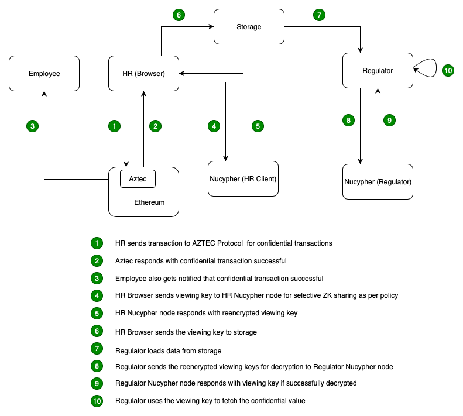

# Selective-ZKP EthIndia2k19

#### Selective-ZKP is a Platform for Role based access view of Confidential Assets created using Zero Knowledge Proofs. These Confidential Assets are created and transfered using Aztec Protocol. Any Confidential Asset value is only visible to Sender and Receiver on Aztec Protocol. 

#### But We Selective-ZKP enhances Aztec Protocol helping users to provide view access to SELECTIVE clients.

### Why do we need this???

### How do we do this???

## Team - nuAztec

## Flow

